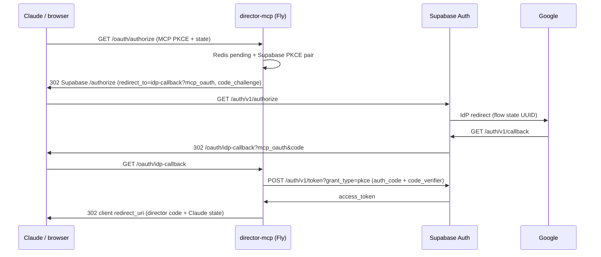

# OAuth on Fly + Supabase — `bad_oauth_state`, Redis PKCE, operator runbook

For **director-mcp** (hosted MCP, e.g. `https://mcp-director.fly.dev`). Director-cut stays on `DIRECTOR_BASE_URL` (tunnel/API). Claude connects to **this** origin for MCP + OAuth.

---

## 1. Root cause (verified against Supabase Auth / GoTrue)

### 1.1 What broke

Production traces showed **`GET https://<project>.supabase.co/auth/v1/callback`** returning **`303`** to the Supabase **Site URL** with `error_code=bad_oauth_state` **before** the browser ever reached **`GET …/oauth/callback`** on Fly.

### 1.2 Why the old `state=…` bridge failed (code)

`src/auth.py` previously built Supabase authorize URLs like:

```text
/auth/v1/authorize?provider=…&redirect_to=…&state=<our_bridge>
```

In **supabase/auth** `GetExternalProviderRedirectURL`, unknown query keys (including **`state`**) are passed through to the upstream IdP via `oauth2.SetAuthURLParam`. That **overrides** the OAuth `state` argument GoTrue already passes to `AuthCodeURL` (the **flow-state UUID** stored in GoTrue’s DB). Google then returned **`state=<our_bridge>`** instead of the UUID. On `/auth/v1/callback`, GoTrue could not resolve flow state → **`bad_oauth_state`**.

This is **not** fixed by tweaking SameSite cookies alone: the failure was **wrong `state` semantics on the wire to Google**, not director-mcp cookies (director-mcp still does not set OAuth cookies).

### 1.3 Second issue: Supabase session PKCE without a durable verifier

Without `code_challenge` / `code_challenge_method` on `/auth/v1/authorize`, the browser-only PKCE path depends on verifier material tied to the **Supabase-hosted** flow. For MCP + embedded browsers, **server-held PKCE** is more reliable.

---

## 2. Design (current implementation)

### 2.1 Responsibilities

| Layer | PKCE / `state` |
|--------|----------------|
| **MCP client (Claude)** | Sends `code_challenge` (S256) + `state` to **`GET /oauth/authorize`**. Stored in Redis for the final hop back to Claude. |
| **director-mcp → Supabase** | Generates **its own** `code_verifier` + `code_challenge`, stores verifier in Redis, sends **only** `code_challenge` + `code_challenge_method=S256` to **`/auth/v1/authorize`**. **Does not send `state`.** |
| **Correlation** | **`mcp_oauth=<bridge>`** is embedded in **`redirect_to`**: `{MCP_BASE_URL}/oauth/idp-callback?mcp_oauth=<bridge>`. |
| **Supabase → Fly** | User returns to **`GET /oauth/idp-callback?mcp_oauth=…&code=…`** (Supabase appends `code`). |
| **Fly → Supabase token** | **`POST /auth/v1/token?grant_type=pkce`** with JSON **`auth_code`** (query `code` from redirect) + **`code_verifier`** from Redis — matches [supabase/auth](https://github.com/supabase/auth) `PKCE` handler (not `grant_type=authorization_code`). |
| **Fly → Claude** | **`302`** to client `redirect_uri` with director-mcp **`code`** + original **Claude `state`**. |

### 2.2 Sequence (numbered)

1. Claude opens **`GET {MCP_BASE_URL}/oauth/authorize?...`** (MCP PKCE params).
2. director-mcp writes **`oauth:pkce:pending:{bridge}`** in Redis (MCP challenge, Claude `state`, **Supabase `code_verifier`**, etc.).
3. Browser **`302`** to **`{SUPABASE_URL}/auth/v1/authorize`** with **`redirect_to`** = idp-callback + `mcp_oauth`, plus **Supabase** `code_challenge` / `code_challenge_method` — **no** `state` query param.
4. Supabase ↔ Google as usual (**Google redirect URI** remains **`https://<project-ref>.supabase.co/auth/v1/callback`** in Google Cloud Console).
5. Browser **`GET /oauth/idp-callback`** on Fly with Supabase auth **`code`** + `mcp_oauth`.
6. Fly **token exchange** with Supabase **`grant_type=pkce`** including **`auth_code`** + **`code_verifier`**; stores Supabase access token in **`oauth:code:{director_code}`** blob for **`POST /oauth/token`**.
7. Fly **`302`** to **`https://claude.ai/api/mcp/auth_callback`** (or whatever the client registered) with **`code` + `state`**.



---

## 3. Code & config map

### 3.1 OAuth routes (`src/auth.py`)

| Route | Role |
|--------|------|
| `GET /.well-known/oauth-authorization-server` | Metadata |
| `GET /.well-known/oauth-protected-resource` | Resource = `{MCP_BASE_URL}/mcp` |
| `GET /oauth/authorize` | Validates MCP client PKCE; stores pending in Redis; redirects to Supabase **with server PKCE**, **no** `state` param |
| `GET /oauth/idp-callback` | **Preferred** first-party return from Supabase |
| `GET /oauth/callback` | Legacy alias (same handler); allowlist **idp-callback** going forward |
| `POST /oauth/token` | MCP client exchanges director `code` + **`code_verifier`** (MCP) for director-mcp JWT; pairs Supabase access in Redis |

### 3.2 Structured logging (no secrets)

Events include **`oauth_authorize_start`**, **`oauth_idp_callback_pending_hit`**, **`oauth_supabase_return_pending_miss`**, **`supabase_token_exchange_failed`** (HTTP status + truncated body), **`oauth_redirect_mcp_client`**, **`oauth_token_issued`**, **`oauth_token_code_miss`**, **`oauth_token_pkce_failed`**. Logs include **`http_request_id`** (from **`Fly-Request-Id`** / **`X-Request-ID`** when present) and **SHA-256 prefixes** for correlation ids and OAuth codes — never raw `code_verifier`, tokens, or full codes.

### 3.3 Env vars

| Variable | Role |
|----------|------|
| `MCP_BASE_URL` | Must match public HTTPS origin (e.g. `https://mcp-director.fly.dev`). Drives **`redirect_to`** host. |
| `SUPABASE_URL`, `SUPABASE_ANON_KEY` | Authorize host + **`grant_type=pkce`** token exchange (**anon** is sufficient server-side; no service role in the browser). |
| `SUPABASE_OAUTH_PROVIDER` | e.g. `google` |
| `REDIS_URL` | Pending PKCE, director codes, upstream token pairing |
| `JWT_SECRET`, `ENVIRONMENT`, `ENFORCE_HTTPS` | As before |

---

## 4. Migration (Supabase + Fly)

1. **Supabase Dashboard → Authentication → URL configuration → Redirect URLs**  
   Add **`https://<your-fly-host>/oauth/idp-callback`** (and keep **`/oauth/callback`** temporarily if you still have old links).  
   Patterns like `https://mcp-director.fly.dev/**` are fine if your project allows them.

2. **Google Cloud Console** (no change for this fix): **Authorized redirect URIs** should still include only  
   **`https://<project-ref>.supabase.co/auth/v1/callback`**  
   — not the Fly host.

3. **Token exchange:** director-mcp calls **`POST /auth/v1/token?grant_type=pkce`** with JSON **`auth_code`** + **`code_verifier`**. Older builds that used `grant_type=authorization_code` get **`unsupported_grant_type`** from GoTrue — deploy this version.

4. **Fly secrets:** no renames required. Ensure **`MCP_BASE_URL`** matches the hostname you put in Supabase allowlists.

5. **Deploy** director-mcp with this version; complete one Connect flow and confirm Fly logs show **`oauth_idp_callback_pending_hit`** then **`oauth_redirect_mcp_client`**.

---

## 5. Verification checklist

1. `curl -sS https://mcp-director.fly.dev/health` → **200**.
2. **Supabase allowlist** includes **`https://mcp-director.fly.dev/oauth/idp-callback`**.
3. From Claude: **Connect once**; in DevTools, confirm **`GET https://mcp-director.fly.dev/oauth/idp-callback`** runs **after** Google and **before** success on Claude.
4. **No** `wmstudio.io?error=…&error_code=bad_oauth_state` from Supabase on success paths.
5. `fly logs`: **`oauth_authorize_start`** → **`oauth_idp_callback_pending_hit`** → **`oauth_redirect_mcp_client`** (or **`supabase_token_exchange_failed`** with actionable snippet).
6. MCP **`tools/list`** and a tool call against **`DIRECTOR_BASE_URL`** return **200** with the paired Supabase token.

---

## 6. Automated tests (CI / local)

```bash
PYTHONPATH=. pytest tests/test_auth.py -v --tb=short
```

Full suite:

```bash
PYTHONPATH=. pytest tests/ -v --tb=short
```

Tests mock **`POST /auth/v1/token?grant_type=pkce`** with **respx** and assert the JSON body includes **`code_verifier`** from Redis and **`auth_code`** matching the simulated Supabase redirect.

---

/manual

## 7. Optional local redirect probe

With app + Redis running, **`follow_redirects=False`** on **`GET /oauth/authorize`** should yield **`302`** to `…supabase.co/auth/v1/authorize` with **`code_challenge`** present and **no** top-level `state` query param.

---

## Related docs

- **[director-cut-discovery-and-prod-setup.md](./director-cut-discovery-and-prod-setup.md)**  
- **[wm-studio-mcp-external-agents.md](./wm-studio-mcp-external-agents.md)**
